# Subdivision Lab 3D

**Surface subdivision in a 3D renderer written from scratch in C++.**
No OpenGL, no windowing toolkit, no image library, no font library.

Computer Graphics mini-project · yosefshanaa

---

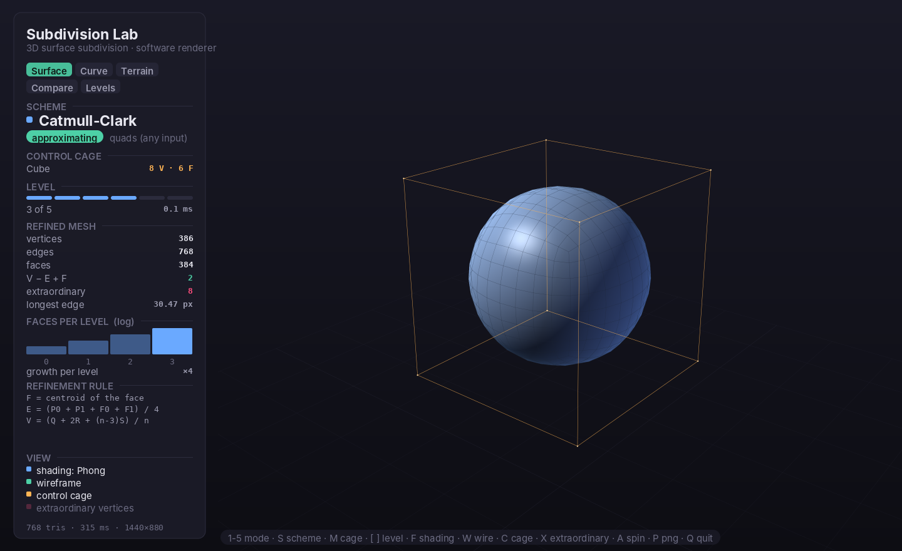

Four subdivision schemes — **Catmull–Clark**, **Loop**, **Doo–Sabin** and
**modified Butterfly** — refine a control cage, while a hand-written software
rasteriser draws the result: model/view/projection, near-plane clipping,
z-buffer, backface culling, Blinn–Phong shading, and depth-tested anti-aliased
overlays for the wireframe and the cage.

**Contents** — [Quick start](#quick-start) · [What it demonstrates](#what-it-demonstrates) ·
[Screenshots](#screenshots) · [Controls](#controls) · [Command line](#command-line) ·
[How it is built](#how-it-is-built) · [Correctness](#correctness) · [Documents](#project-documents)

---

## Quick start

```sh
make            # build ./subdivlab
make run        # build and open the interactive window
make test       # run the numeric self test (16 checks)
make screenshots  # regenerate every image in this README, from the app itself
```

**Requirements: a C++17 compiler.** That is the complete list — `g++ src/*.cpp -o
subdivlab` also works. `ldd subdivlab` reports only `libc`, `libm`, `libstdc++`
and `libgcc`.

The interactive window uses Xlib, but it is loaded at **runtime** with `dlopen`,
so there are no `-dev` packages to install, and the program still builds and runs
on a machine with no display:

```sh
./subdivlab --shot out.png --mesh torus --scheme catmull-clark --level 3
```

`--shot` and the interactive window call the same `renderFrame()`, so a saved PNG
is pixel-for-pixel what the window shows.

> **Note on v1.** The first version of this project was a single-file HTML/Canvas
> demo of *curve* subdivision in 2D. This is a rewrite, not a port: the language,
> the dimensionality and the subject all changed. The curve schemes survive as
> one mode of the new app (press `2`) because they are the one-dimensional
> ancestors of the surface rules — see [the correspondence table](#curves-the-1d-ancestor).

---

## What it demonstrates

| Concept | Where you see it |
|---|---|
| **Control cage → limit surface** | The orange cage stays drawn over the refined surface at every level |
| **Approximating schemes** — Catmull–Clark, Loop, Doo–Sabin | The surface pulls *away* from the cage; the cage is only a hull |
| **Interpolating scheme** — modified Butterfly | The surface passes *exactly through* every cage vertex — measured as bit-exact in `make test` |
| **Primal vs dual refinement** | Catmull–Clark splits faces (cube → 26 V / 48 E / 24 F); Doo–Sabin builds the dual and gets exactly 24 / 48 / 26 |
| **Exponential growth — why ~5 levels is "infinity"** | Every level multiplies the face count by 4; shown as a log-scaled chart and as four tiled levels |
| **Extraordinary vertices** | Valence ≠ 4 (quad mesh) or ≠ 6 (triangle mesh), marked in pink — their *count never grows* |
| **Boundary rules** | Catmull–Clark pins corners and runs a cubic B-spline along an open border; Butterfly's boundary rule *is* the Four-Point curve scheme |
| **Topological invariants** | V − E + F is displayed live and audited for 4 schemes × 10 cages in the self test |
| **The rendering pipeline** | Transforms, clipping, rasterisation, z-buffer and three shading models — all implemented, not called |
| **Curve subdivision** | Chaikin, Four-Point and midpoint displacement, in 3D space |
| **Procedural generation** | Diamond–square terrain: midpoint displacement with one more dimension |

---

## Screenshots

Every image below is the program's own output, produced by `make screenshots`.
The command line for each one is recorded in the gallery table in
[`src/main.cpp`](src/main.cpp).

### Level progression — the face count ×4 at every step

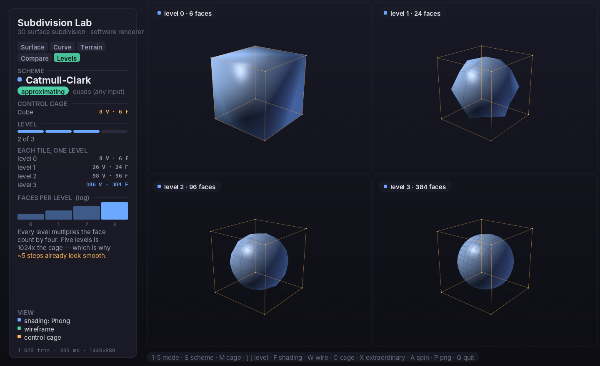

6 → 24 → 96 → 384 faces. `[` and `]` slide this four-level window up to level 5,
where the cube has 6 144 faces and is visually indistinguishable from the one
before it — the lecture's "about five iterations is effectively infinity", made
literal.

### Four schemes on one cage

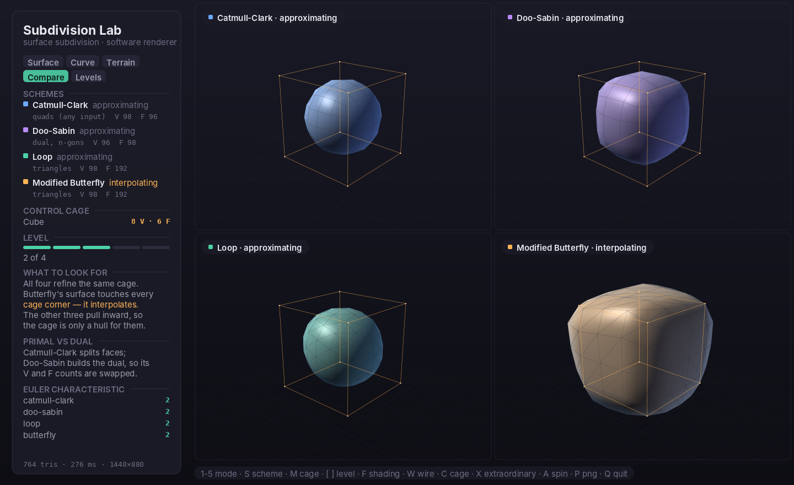

The single most useful frame in the project: **Butterfly's surface touches every
corner of the cage** because it interpolates. The other three shrink inside it.

### Interpolating vs approximating, close up

| Modified Butterfly — passes through the cage | Loop — pulls away from it |
|---|---|
| 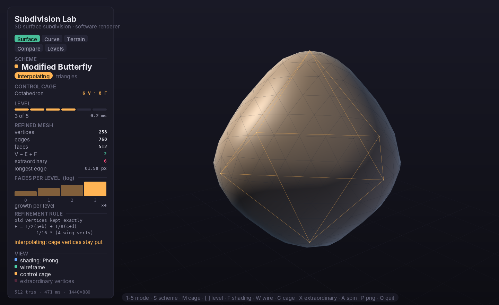 | 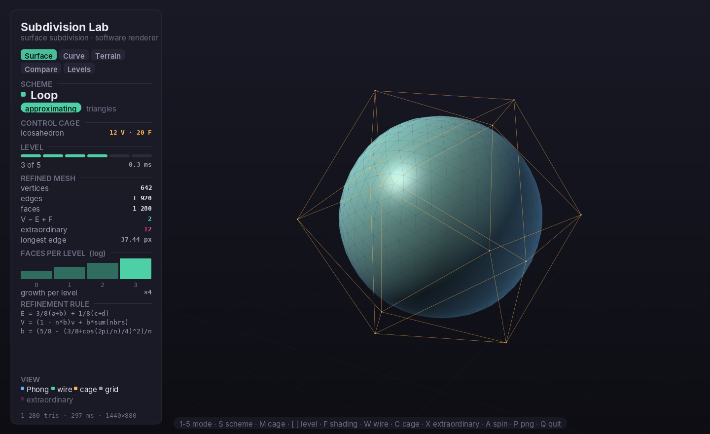 |

### Doo–Sabin — the dual scheme

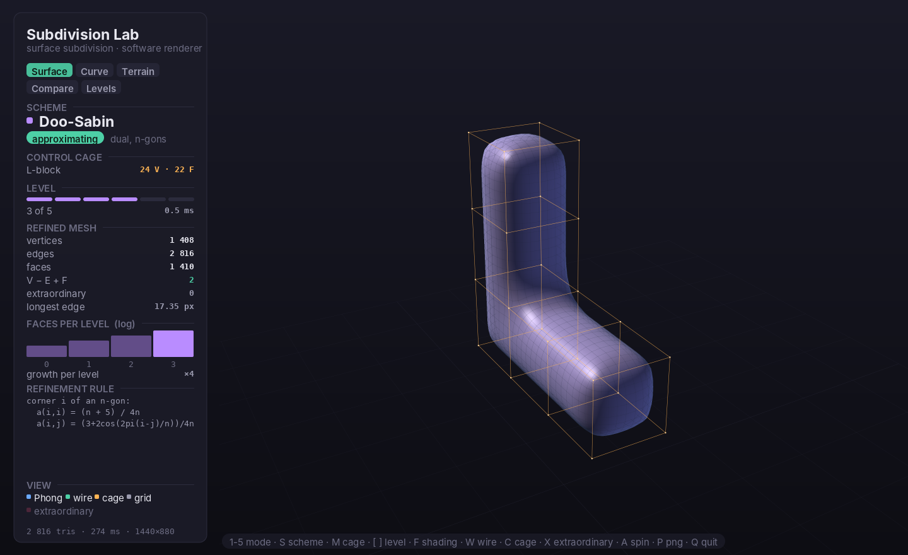

Every old face shrinks to a smaller copy; every old edge and vertex becomes a new
face. On a closed mesh the result has **only valence-4 vertices**, which is why
the extraordinary counter reads 0.

### Extraordinary vertices stay put

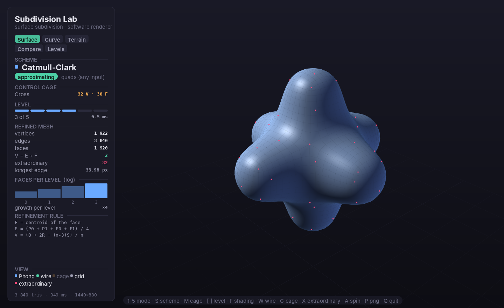

The Cross cage has 32 irregular vertices and still has exactly 32 at level 4,
while the vertex count itself climbs 32 → 122 → 482 → 1 922 → 7 682. Subdivision
does not create extraordinary vertices; it isolates the ones the cage already had.
That is precisely why the limit surface is smooth everywhere except at finitely
many points.

### Boundary rules on an open patch

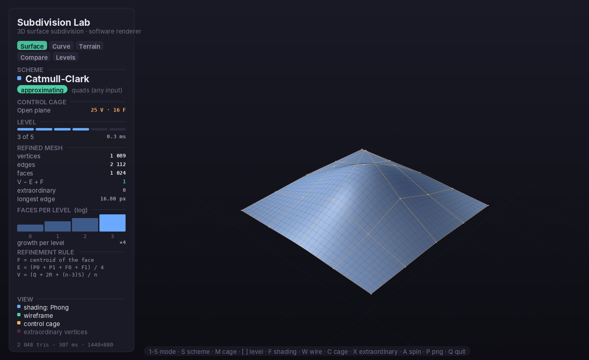

The four corners stay pinned, the border converges to a cubic B-spline through the
boundary polygon, and V − E + F drops to **1** — the Euler characteristic of a
disk rather than a sphere.

### Topology survives refinement

| Torus under Catmull–Clark — χ = 0 | Open cylinder under Loop — χ = 0, two boundary rims |
|---|---|
| 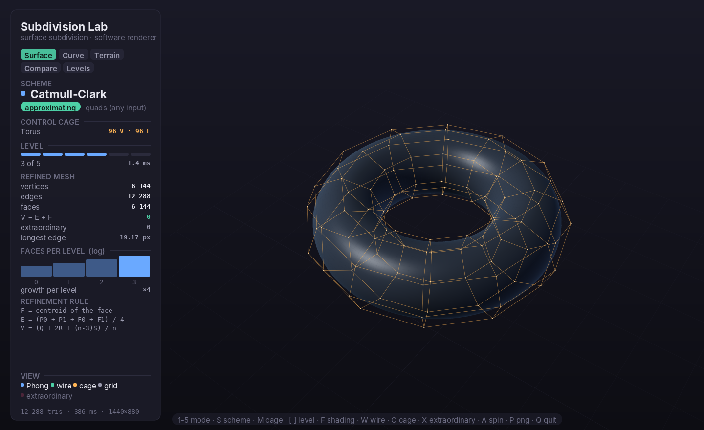 | 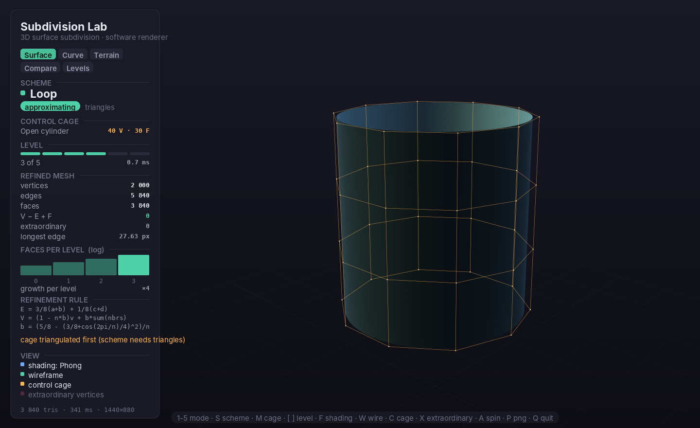 |

Subdivision refines geometry, never topology. The cylinder also shows Loop
announcing that it triangulated the quad cage first, because Loop is defined only
on triangles.

### Shading models

| Flat — one normal per face | Phong — interpolated per pixel |
|---|---|
| 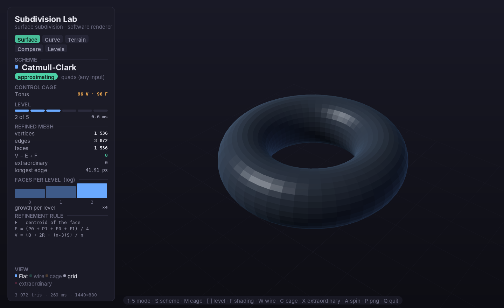 | 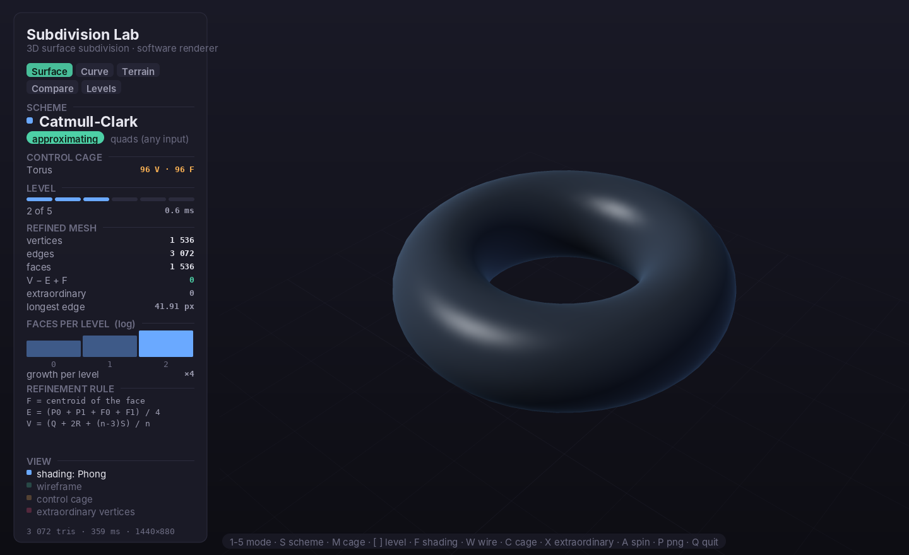 |

Same mesh, same level, one keypress apart. Flat shading also makes the
subdivision level visible a second way: you can count the facets.

### Curves: the 1D ancestor

| Four-Point at w = 1/16 — smooth, interpolating | w = 0.25 — the same scheme goes fractal |
|---|---|
| 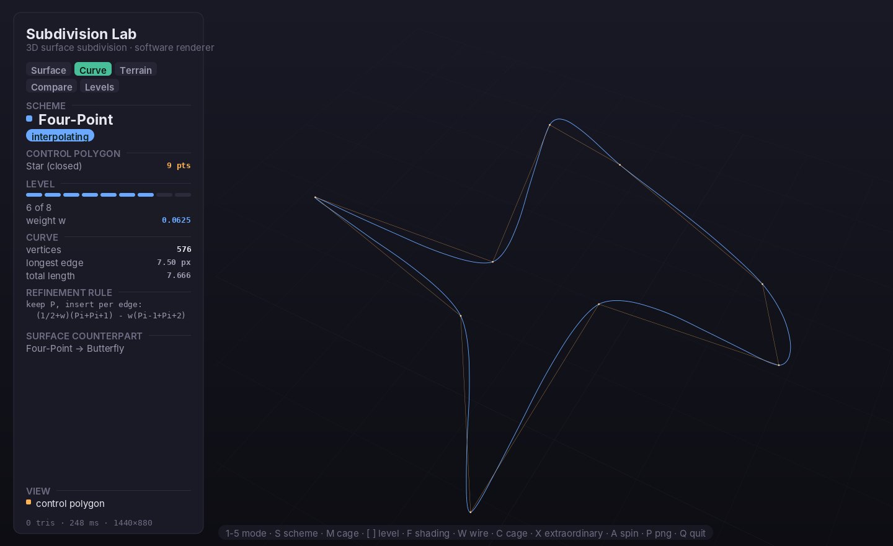 | 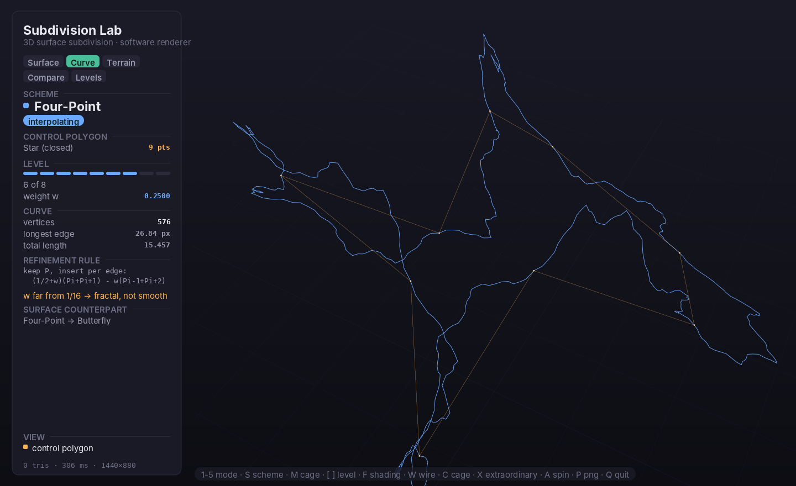 |

Chaikin on an open polyline, where the endpoints have to be anchored explicitly:

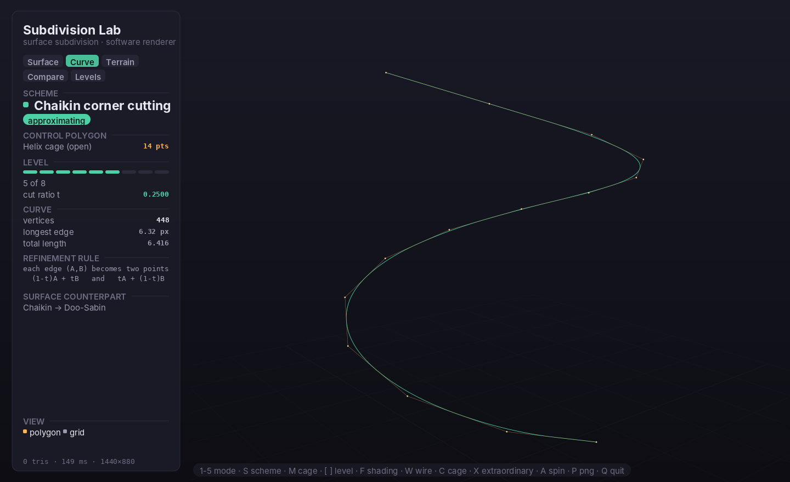

Each curve scheme has a surface counterpart, and the correspondence is exact
rather than merely analogous:

| Curve scheme | Surface counterpart | Why they are the same idea |
|---|---|---|
| Chaikin corner cutting | Doo–Sabin | Both approximating; Doo–Sabin's boundary rule *is* Chaikin, so an open Doo–Sabin surface has a Chaikin curve for a border |
| Four-Point | Modified Butterfly | Both interpolating; Butterfly's boundary rule *is* the Four-Point rule, coefficients and all (9/16, −1/16) |
| Midpoint displacement | Diamond–square | The same recipe one dimension up: displace a midpoint, shrink the range, repeat |

### Diamond–square terrain

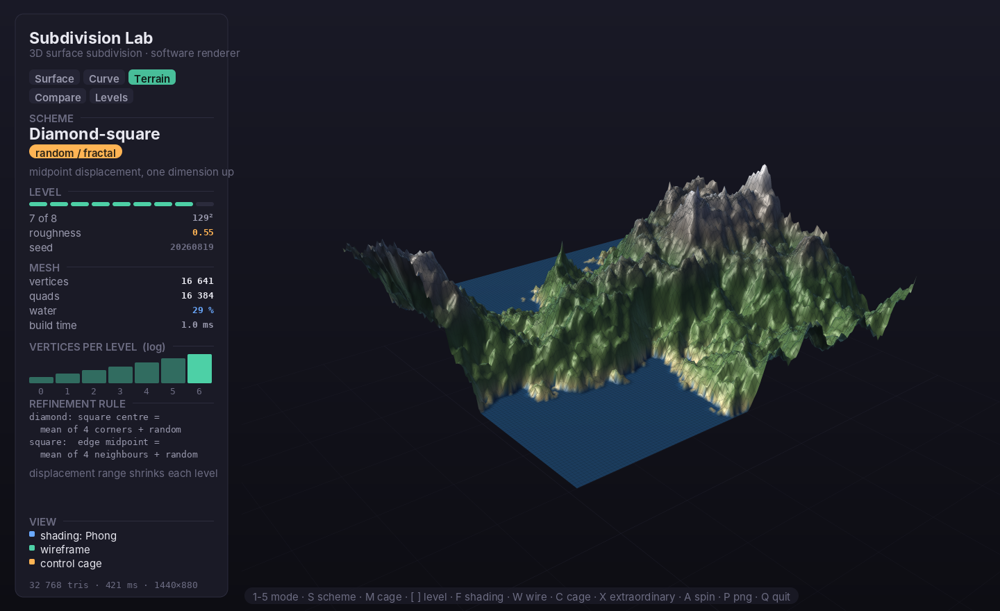

Each square gets a displaced centre, each diamond a displaced edge midpoint, and
the displacement range shrinks every level. 129 × 129 vertices in about 1 ms.

---

## Controls

| Key | Action |
|---|---|
| `1` … `5` | Surface / Curve / Terrain / Compare / Levels |
| `S`, `⇧S` | Next / previous scheme |
| `M`, `⇧M` | Next / previous control cage (or curve preset) |
| `[` `]` | Subdivision level down / up |
| `,` `.` | Scheme parameter — curve weight, terrain roughness |
| `F` | Shading: flat → Gouraud → Phong |
| `W` `C` `G` | Wireframe / control cage / ground grid |
| `X` `N` | Extraordinary vertices / face normals |
| `A` | Auto-spin |
| `E` | Re-roll the random seed (terrain, midpoint-displacement curves) |
| `R` | Reset the camera |
| `H` | Hide the HUD |
| `P` | Save a 1440 × 880 PNG next to the binary |
| `Q` / `Esc` | Quit |

Drag to orbit, scroll to zoom; arrow keys and `z` / `⇧Z` work too. Keys that
cannot apply in the current mode do nothing.

---

## Command line

```
subdivlab                        open the interactive window
subdivlab --shot FILE.png        render one frame and exit
subdivlab --gallery DIR          render every documentation screenshot
subdivlab --selftest             verify the schemes numerically

Scene
  --mode surface|curve|terrain|compare|levels
  --mesh cube|tetrahedron|octahedron|icosahedron|torus|plane|cylinder|
         lblock|cross|pyramid
  --scheme catmull-clark|loop|doo-sabin|butterfly|none
  --level N                        subdivision level (0..5)
  --curve-scheme chaikin|four-point|midpoint
  --curve-preset N  --curve-param F  --curve-level N
  --terrain-level N  --roughness F  --seed N

View
  --width N --height N --ss N      canvas size and supersampling (1..4)
  --yaw F --pitch F --dist F       camera, radians / world units
  --shading flat|gouraud|phong
  --no-cage --no-wire --no-grid --no-hud --extraordinary --normals
```

Out-of-range values are clamped rather than rejected, in one place
(`AppState::clampToLimits`), so the command line obeys exactly the limits the
keyboard does. `subdivlab --help` prints the full list.

---

## How it is built

```
src/
  vecmath.h           Vec2/3/4, Mat4, lookAt / perspective
  mesh.{h,cpp}        polygon mesh + edge/vertex/face adjacency, boundary
                      detection, ordered one-ring traversal, mesh statistics,
                      orientation audit, ten base cages
  subdiv_surface.*    Catmull-Clark, Loop, Doo-Sabin, modified Butterfly
  subdiv_curve.*      Chaikin, Four-Point, midpoint displacement (in 3D)
  terrain.*           diamond-square heightfield
  render.{h,cpp}      the software pipeline: clipping, rasterisation, z-buffer,
                      shading, depth-tested lines and points, viewports
  canvas.{h,cpp}      2D surface, anti-aliased primitives, text rendering
  font_data.h         generated glyph atlases (tools/genfont.py)
  png.{h,cpp}         PNG writer including its own DEFLATE, CRC-32, Adler-32
  hud.cpp             the readout panel
  app.{h,cpp}         state, scene composition, input
  x11window.*         window via dlopen'd Xlib
  main.cpp            CLI, interactive loop, gallery, self test
```

About 5 000 lines of C++ across 21 files, plus a 1 400-line generated font header.

Four decisions worth calling out:

- **The rasteriser is the point.** A project that calls `glDrawElements`
  demonstrates the API; this one implements the pipeline the lectures describe.
  The matrices, the Sutherland–Hodgman near-plane clip, the barycentric coverage
  test, perspective-correct interpolation and the depth buffer are all in
  `render.cpp`.
- **No dependencies, deliberately.** The PNG encoder writes its own DEFLATE
  stream; the text renderer draws from glyph atlases baked by `tools/genfont.py`
  into a committed header, so the build never needs Python; and Xlib is
  `dlopen`ed rather than linked.
- **Anti-aliasing by supersampling.** The scene renders at up to 3× and is
  box-filtered down; the HUD is drawn *after* the resolve, at native resolution,
  so text is never softened.
- **Subdivision is capped.** Face counts grow 4× per level, so the driver stops
  before crossing a budget rather than freezing the machine.

---

## Correctness

`make test` runs 16 checks in about a second:

```
Topology: Euler characteristic V-E+F is preserved by every scheme
  [PASS] 40 mesh/scheme combinations keep their Euler characteristic
Orientation: every refined face is wound consistently with its neighbours
  [PASS] no directed-edge defects in 40 refined meshes or 10 cages
Known refinement counts on the cube
  [PASS] Catmull-Clark level 1: 26 V / 48 E / 24 F  (V+E+F of the cage)
  [PASS] Doo-Sabin level 1: 24 V / 48 E / 26 F  (exactly the dual)
  [PASS] Doo-Sabin makes every vertex valence 4
Interpolating vs approximating
  [PASS] Butterfly leaves every control vertex exactly in place
  [PASS] Catmull-Clark pulls control vertices inward (approximating)
Boundary rules
  [PASS] Catmull-Clark pins the corners of an open patch
  [PASS] Loop keeps an open patch manifold
Curve schemes
  [PASS] Chaikin on a square yields 8 points
  [PASS] Chaikin cuts at 1/4 and 3/4 (the classic 1:3 cut)
  [PASS] Four-Point with w = 0 gives plain midpoints
  [PASS] Four-Point keeps the control points (interpolating)
Budgets
  [PASS] the face budget stops runaway subdivision
Renderer
  [PASS] renderFrame produces a non-trivial image
  [PASS] canvas converts to a packed RGB buffer
```

The orientation audit is there because it is the check that actually found a bug:
Doo–Sabin produced a perfect dual of the cube at level 1 and collapsed at level 2,
and backwards-wound faces leave V, E, F — and therefore the Euler characteristic —
completely unchanged. [REPORT.md §4.1](REPORT.md) has the diagnosis.

Measured refinement cost on the 96-face torus cage (`-O2`, one core):

| Level | faces | Catmull–Clark | Doo–Sabin | Loop | Butterfly |
|---|---|---|---|---|---|
| 2 | 1 536 | 0.5 ms | 0.6 ms | 0.7 ms | 1.1 ms |
| 3 | 6 144 | 1.8 ms | 2.3 ms | 3.3 ms | 4.6 ms |
| 4 | 24 576 | 8.2 ms | 10.1 ms | 13.6 ms | 26.4 ms |
| 5 | 98 304 | 39 ms | 45 ms | 75 ms | 122 ms |

Butterfly is slowest because its stencil needs an ordered one-ring walk per edge;
the others only need averages over unordered adjacency.

---

## Project documents

| File | What is in it |
|---|---|
| [PRD.md](PRD.md) | Requirements, success criteria, explicit non-goals |
| [PLAN.md](PLAN.md) | Architecture, the exact stencil for every scheme, the render pipeline |
| [TODO.md](TODO.md) | Milestone task list, with how each item was verified |
| [REPORT.md](REPORT.md) | Course report: feature → concept mapping, and the problems actually hit |

### Commit history

This project is also kept as a standalone repository:

**<https://github.com/yosefshanaa/curve-subdivision-lab>**

It is there for the commit history. The same seventeen commits appear in both
places — ten for the v1 HTML curve app, seven for the C++ rewrite — but in the
standalone repository they sit at the repo root rather than under
`FinalProject/`, so the incremental work reads in one place without the rest of
the course repository interleaved. Only the commit hashes differ, because the
history was replayed under the `FinalProject/` prefix when it was brought in
here.
