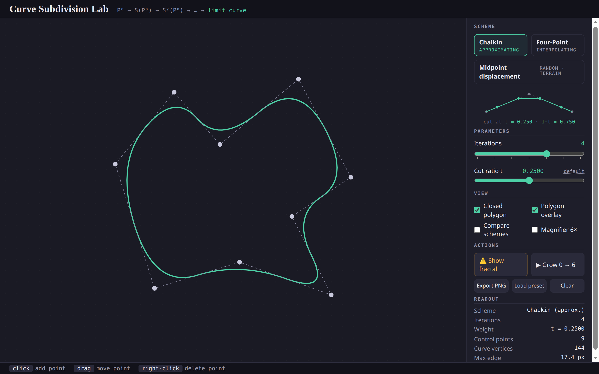
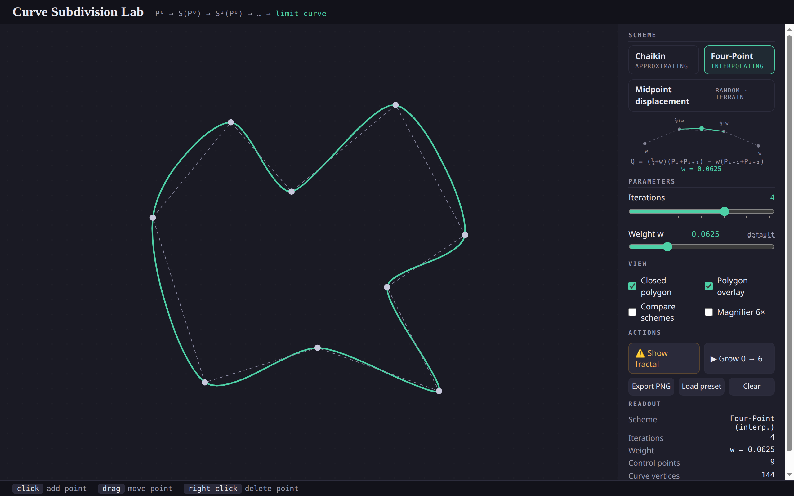
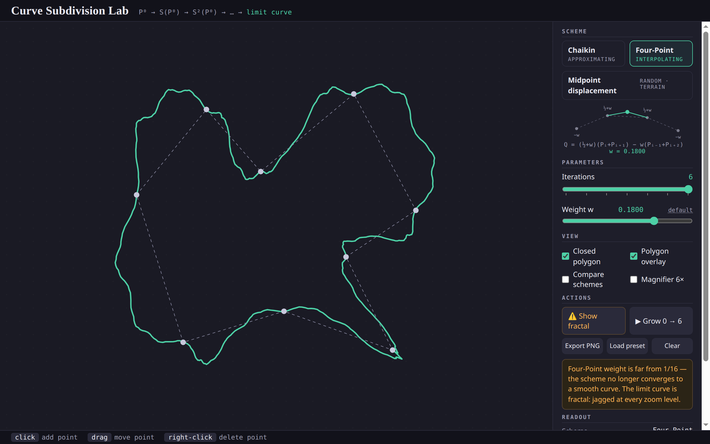
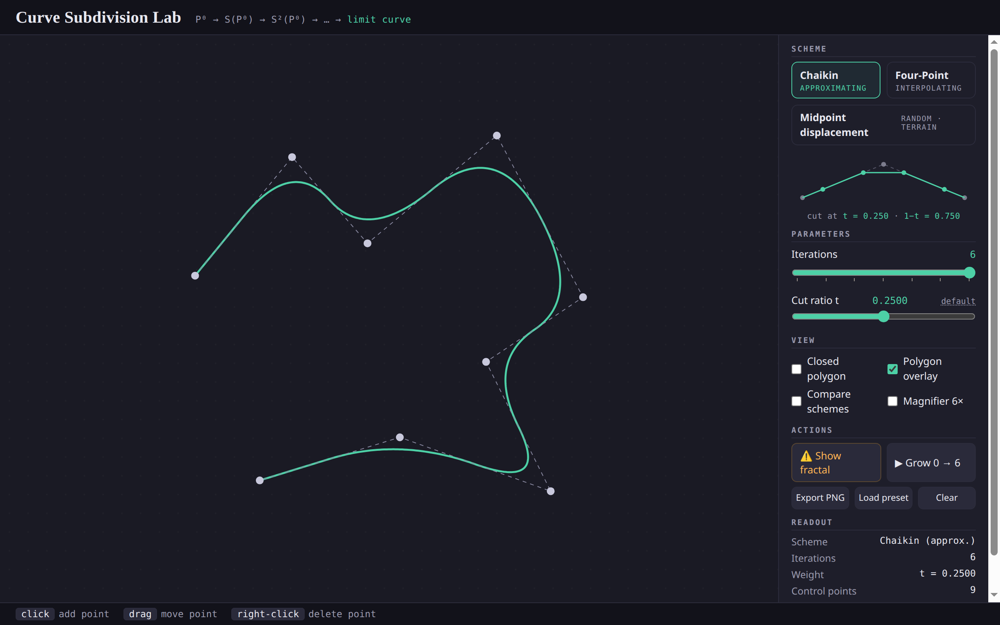
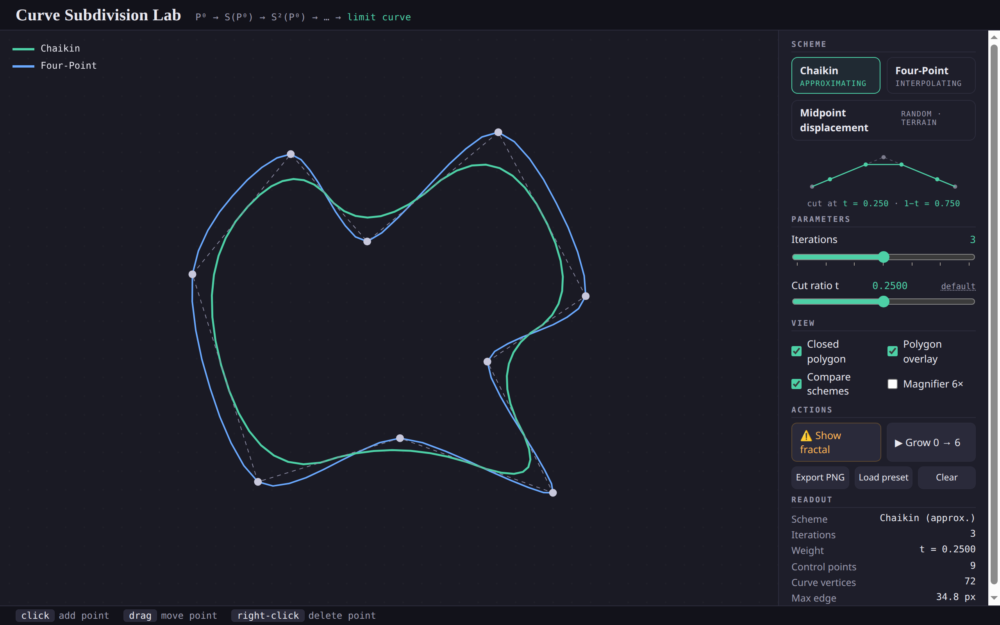
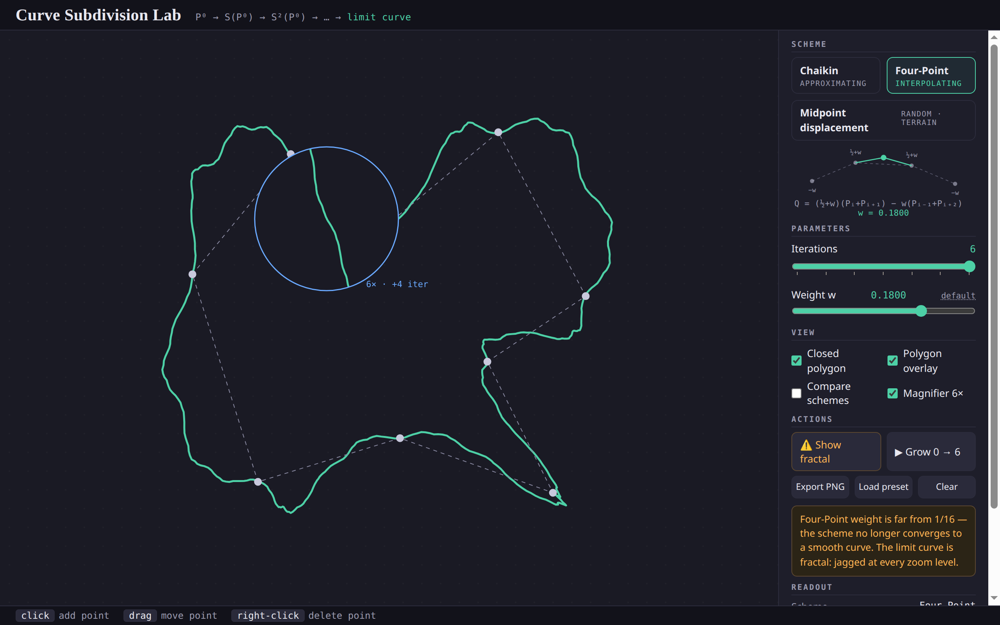
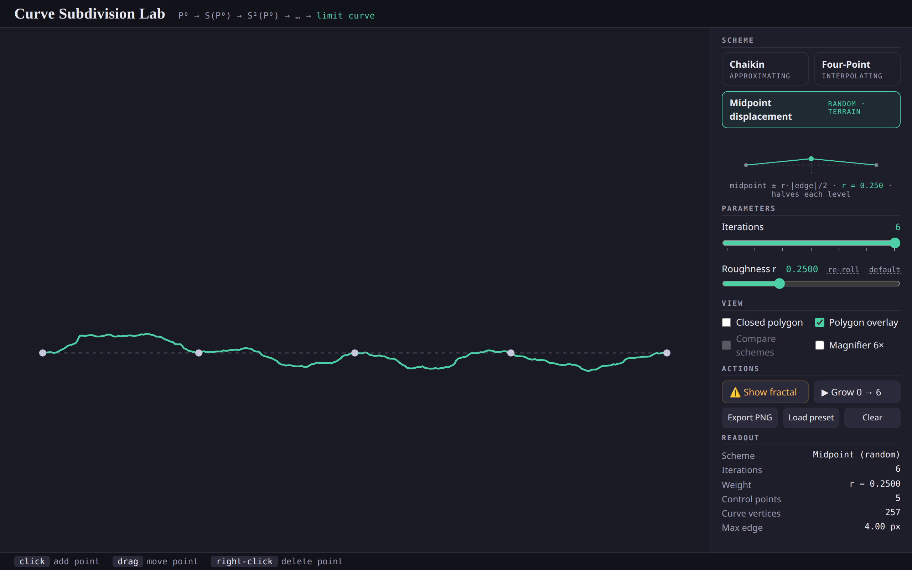

# Report — Interactive Curve Subdivision Lab

> Computer Graphics mini-project. Based on the Subdivision part of the "Hidden Surface Removal + Subdivision" lecture.

## Goal

An interactive single-file web app (HTML5 Canvas + vanilla JS, zero dependencies) demonstrating subdivision of curves: control polygon editing, the Chaikin corner-cutting scheme (approximating) and the Four-Point scheme (interpolating), adjustable weights, iteration control, and the fractal behavior that appears when the Four-Point weight moves far from 1/16.

## How to run

Open `index.html` in any modern desktop browser (double-click works — no server, no build, no dependencies). A demo polygon loads automatically; click to add points, drag to move them, right-click to delete.

## Milestone 1 — Core

Implemented: page layout with canvas + control sidebar; HiDPI-aware canvas; control-polygon editor (click-add with add-then-drag in one gesture, drag-move with live curve update, right-click delete, open/closed toggle, clear/preset); both subdivision schemes as pure functions behind a shared driver with a 20,000-vertex safety cap.

The scheme math was verified numerically in Node before any UI testing:
- Chaikin on the unit square with t = 0.25 produces the 8 known corner-cut points.
- Four-Point with w = 0 inserts exact midpoints.
- Four-Point on an open 3-point "V" keeps all original points (interpolating) and the phantom-reflection endpoints produce the hand-computed inserted point (0.5, 0.625).
- The driver stops early at the vertex cap (500-point polygon: stops after 5 of 6 iterations at 16,000 vertices).

**Chaikin (approximating) — the curve cuts corners and pulls away from the control points:**

## Milestone 2 — Interactivity

Implemented: iterations slider (0–6); contextual weight slider (cut ratio t for Chaikin, weight w for Four-Point — separate state fields, one-click reset to default); overlay toggle; fractal preset with a state-driven warning caption (shown whenever w > 1/8, however it got there); live stats panel with scheme classification, vertex count, and max-edge length with an "≈ limit curve" badge below 1 px.

**Four-Point (interpolating) — same polygon, but the curve passes through every control point:**

**Fractal mode — one click sets w = 0.18 (far from 1/16) at 6 iterations; the curve stops converging to anything smooth:**

**Open polyline (Chaikin) — endpoints stay anchored:**

The full app was also exercised headlessly through the Chrome DevTools Protocol: all UI flows from the test checklist (scheme switching, iteration sweep, fractal preset on/off, open/closed endpoint anchoring, too-few-points hints, degenerate coincident/collinear inputs, vertex-cap behavior) ran with **zero console errors**.

## Milestone 3 — Optional polish

Implemented all three optional features: an "auto-grow" button that animates iterations 0→6 to show the curve refining toward the limit curve; PNG export of the canvas; and a side-by-side compare mode that renders both schemes on the same control polygon in two colors with a legend — the clearest single view of approximating vs interpolating.

### Visual design pass

A later polish pass restyled the UI while keeping the same palette: serif title with the subdivision pipeline (P⁰ → S(P⁰) → S²(P⁰) → … → limit curve) as a monospace formula, segmented scheme cards, a graph-paper dot grid drawn in-canvas (so PNG export keeps it), tick marks on the iteration slider, and an instrument-style readout grid. The signature addition is a **live stencil diagram** under the scheme selector: a miniature polyline where the actual insertion formula computes the new points, so moving the t/w slider physically moves the cut points (Chaikin) or pushes the inserted point Q outward (Four-Point) — the scheme's rule is visible before it is ever applied to the real curve.

## v2 additions

Two additions after the first review round, both taken from lecture material:

**Magnifier lens (6×, +4 iterations).** A cursor-following lens re-renders the active curve as vector geometry at 6× — subdivided four levels *deeper* than the on-screen curve, with the same seed. This turns two lecture claims into something you can see: a correct scheme flattens under magnification (its limit curve is smooth), while the wrong-weight Four-Point curve stays jagged inside the lens — the fractal lecture's "sharp at every zoom level." It also shows that the "~5 iterations" rule is resolution-dependent: under magnification, more iterations are needed.

**Random midpoint displacement (third scheme).** The procedural-terrain recipe from the fractals/procedural-generation lecture is itself a subdivision scheme: keep old points, insert each edge's midpoint displaced along the edge normal by a random amount within ± r·|edge|/2. Because edges halve each iteration, the displacement range halves too — exactly the lecture's rule. Seeded RNG keeps the terrain stable across redraws (and lets the lens extend the same terrain deterministically); a re-roll button draws a new seed. An open, flat polyline turns into a mountain silhouette:

## Feature → lecture-concept mapping

| Lecture concept | Where it is visible in the app |
|---|---|
| Control polygon / control points | Dashed gray overlay + draggable dots, always drawn over the curve |
| Limit curve | Bold curve at high iterations; "≈ limit curve" badge when edges < 1 px |
| Approximating scheme (Chaikin, ~1:3 corner cutting) | Chaikin mode: curve visibly misses the dots; t slider generalizes the cut ratio |
| Interpolating scheme (Four-Point) | Four-Point mode: curve visibly threads through every dot |
| Scheme weights matter / wrong weights → fractal | w slider + "Show fractal behavior" preset + warning caption when w > 1/8 |
| ~5 iterations are "infinity" in practice | Stats: vertex count doubling, max-edge halving each iteration, sub-pixel badge |
| Subdivision cost warning (over-subdividing freezes machines) | 20,000-vertex cap with a "capped" note in the stats panel |
| Fractal self-similarity — "sharp at every zoom level" (Lecture 2) | Magnifier lens: smooth curves flatten at 6×, fractal curves stay jagged |
| Random midpoint displacement / procedural terrain (Lecture 2) | Third scheme: midpoint ± r·\|edge\|/2, range halves per level, seeded + re-roll |

## Problems encountered

- **Four-Point at open endpoints.** The stencil needs P_{i−1} and P_{i+2}, which don't exist at the ends of an open polyline. Index clamping flattens the curve near the endpoints, so I used phantom points by reflection (P_{−1} = 2P₀ − P₁), which linearly extrapolates past the ends; a single index-resolver function keeps the loop identical for open and closed modes.
- **Chaikin shrinks open curves at the ends.** Pure corner cutting also cuts the two end "corners", so the curve detaches from the first/last control points. Fixed by re-anchoring the original endpoints after each step.
- **The "~5 iterations" rule depends on initial edge length.** For the sparse 9-point preset (edges ~300 px) the max edge is still ~5 px after 6 iterations; for a densely clicked polygon (edges ~50 px) it reaches sub-pixel at 5–6, matching the lecture's rule of thumb. The stats panel shows the halving either way, so the rule's assumption is itself visible.
- **A "capped iterations" note initially appeared for the wrong reason** — with too few control points, effective iterations are 0, which the stats code first misreported as hitting the vertex cap. Fixed by distinguishing the two conditions.
